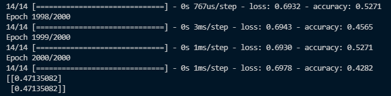

# ToyPjt : 대학원 합격/불합격 예측확률 딥러닝

| 구분   | 진행상태           | 과제명                               | 비고      |
| ------ | ------------------ | ------------------------------------ | --------- |
| `필수` | :white_check_mark: | 1-1. 데이터 읽기 및 시각화           | ToyPjt.py |
| `필수` | :white_check_mark: | 1-2. 선형 모델 클래스 구현           | ToyPjt.py |
| `필수` | :white_check_mark: | 1-3. 최적화 함수 및 손실 함수 바이딩 | ToyPjt.py |
| `필수` | :white_check_mark: | 1-4. 모델 학습 함수 구현             | ToyPjt.py |

- 빌드
  1. `pip install tensorflow`
  2. `python ToyPjt.py`
  
- Pjt 내용
  - csv파일로 영어성적, 학점, 지원한 대학원랭킹(train_x)과 합격여부(train_y)를 가지고 학습을 시킨다.
  - csv의 각 컬럼은 다음과 같다.(gpascore.csv)
    - admit: 합격여부
    - gre: 영어성적
    - gpa: 학점
    - 대학의 rank
  
- 결과

    - epochs=2000을 수행하였고, test값을 예측하기 위해 `model.predict([[750, 3.70, 3], [400, 2.2, 1]])` 하였다.

  

  ​				데이터값이 많이 없으므로 정확도가 매우 떨어지는 것을 알 수 있다. 예측값 확률 또한 약 47%이다. 

  - 왜 이러한 결과?

    - 데이터값이 많이 없으므로 인공지능이 학습데이터를 외워버렸으므로 정확도가 떨어진다.
    - Toy-PJT2에서 이미지 캡셔닝을 구현하면서 정확도(accuracy)를 높여보도록하자.

