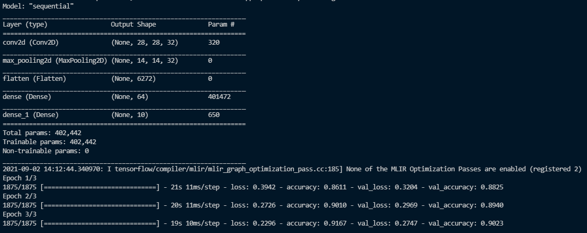
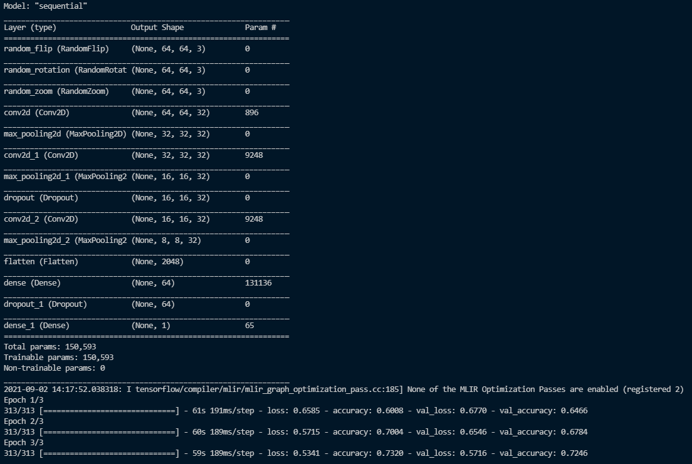
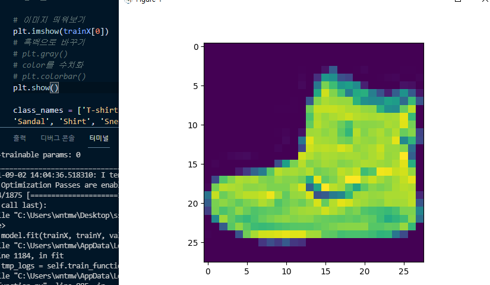
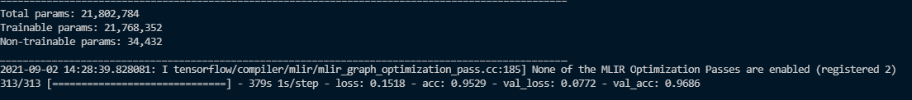

## ToyPjt: 의류사진 구분, ToyPjt2: 강아지/고양이 구분

| 구분 | 진행상태           | 과제명                                   | 비고      |
| ---- | ------------------ | ---------------------------------------- | --------- |
| 추가 | :white_check_mark: | 5-1. Fashion MNIST 데이터 다운 및 시각화 | ToyPjt.py |
| 추가 | :white_check_mark: | 5-2. 인공신경망 구현 및 컴파일           | ToyPjt.py |
| 추가 | :white_check_mark: | 5-3. 모델 학습 및 테스트                 | ToyPjt.py |

- ToyPjt

  - 내용: 의류사진 카테고리별로 구분

  - 결과(과제명: 5-1~5-3)

    

    epoch=3으로 학습을 시킨후 test넣었을때 val_accuracy가 약 90%의 성능을 보여주었다.

- ToyPjt2

  - 내용: 개/고양이 binary 구분

  - 준비사항: https://www.kaggle.com/c/dogs-vs-cats-redux-kernels-edition/data에서 data를 다운받은후, Toy-PJT2폴더에 넣으면 끝!

  - 결과

    

    epoch=3으로 학습을 시킨후 test넣었을때 val_accuracy가 약 72%의 성능을 보여주었다.


| 구분   | 진행상태           | 과제명                               | 비고       |
| ------ | ------------------ | ------------------------------------ | ---------- |
| `필수` | :white_check_mark: | 3-1. 이미지 경로 및 캡션 불러오기    | ToyPjt2.py |
| `필수` | :white_check_mark: | 3-2. 전체 데이터셋을 분리해 저장하기 | ToyPjt2.py |
| `필수` | :white_check_mark: | 3-3. 저장된 데이터셋 불러오기        | ToyPjt2.py |
| `필수` | :white_check_mark: | 3-4. 데이터 샘플링                   | ToyPjt2.py |

- 3-1~3-4에 대한 코드는 다음과 같다.

  ```python
  for i in os.listdir('train/'):
      if 'cat' in i:
          shutil.copyfile('train/' + i, 'dataset/cat/' + i)
      if 'dog' in i:
          shutil.copyfile('train/' + i, 'dataset/dog/' + i)
  ```

  train에 cat과 dog파일들이 같이 들어있는데 dataset폴더안의 각각의 라벨을 붙여 분류하였다.

  

| 구분   | 진행상태           | 과제명                    | 비고      |
| ------ | ------------------ | ------------------------- | --------- |
| `필수` | :white_check_mark: | 4-1. 이미지와 캡션 시각화 | ToyPjt.py |

- 4-1에 대한 코드는 다음과 같다.

  ```python
  # 이미지 띄워보기
  plt.imshow(trainX[0])
  # 흑백으로 바꾸기
  # plt.gray()
  # color를 수치화
  # plt.colorbar()
  plt.show()
  ```

  - 결과

    


## 추가학습: ToyPjt3

- ToyPjt2의 성능을 올리기위해 전이학습을 진행하였다. `inception_v3` 를 이용하였고 구현 코드는 `ToyPjt3.py`에 있다. 결과는 다음과 같이 나왔다.

  

  epoch=1을 하였음에도 val_acc가 96%가 나온것을 확인할 수 있다. model 설계의 중요성을 알 수 있다. 구글링으로 인공지능에 대해 새로운 사실을 알게된 것이 있는데, 그것은 전이학습이 유행이고 최고라는 것이다..

  

