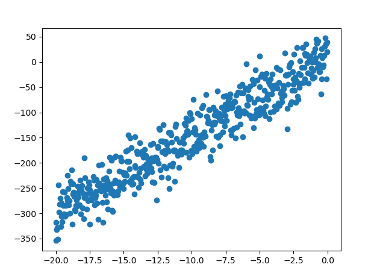
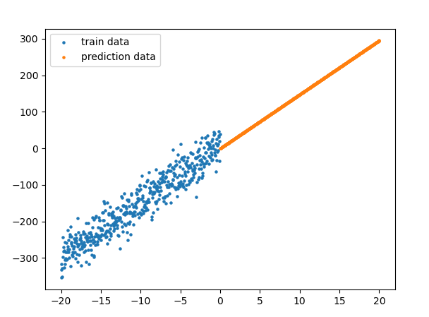

## 인공지능(영상) 프로젝트

  * 이미지 파일
    - 용량이 큰 관계로 별도 링크를 통해 다운로드 후 datasets 폴더에 압축을 해제하여 사용합니다.
    - 다운로드: [https://drive.google.com/drive/folders/1_Md_iaLUsChAHEcm9bVDS9TfbTT7K8A_](https://drive.google.com/drive/folders/1_Md_iaLUsChAHEcm9bVDS9TfbTT7K8A_)

## SUB1

| 구분      | 진행상태             | 학습시간 | 과제명                      | 비고 |
| --------- | -------------------- | -------- | --------------------------- | ---- |
| `Req. 1.` | :white_check_mark:   | 3        | 단순 선형 회귀 모델 구현    |      |
| `Req. 2.` | :white_large_square: |          | 이미지 캡셔닝 Configuration |      |
| `Req. 3.` | :white_large_square: |          | 이미지 캡셔닝 데이터 전처리 |      |
| `Req. 4.` | :white_large_square: |          | 데이터 시각화               |      |

#### Req. 1.

